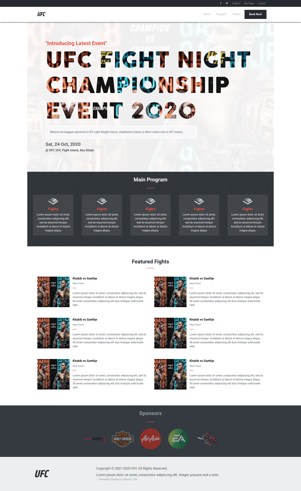
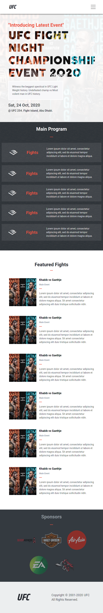

# Capstone Project (HTML/CSS)

> Created a responsive Fight Event website inspired by [Sindy Shin](https://www.behance.net/gallery/29845175/CC-Global-Summit-2015) design. Projects includes differnet stylings of screens i.e. Moble UI, Desktop UI. Dynamic images and content develped using Bootstrap, Flex boxes, Media Queries, Fontawsome Icons and some external resources. 

## Desktop UI

## Tablet UI

## Built With

- HTML
- SASS
- Bootstrap
- Font Awesome Icons
- Linters
- Gitflows

## Live Demo

[Live Demo Link](https://bashforger.github.io/capstone_project_i/)

## Author

👤 **Adeel**

- GitHub: [@githubhandle](https://github.com/bashforger)
- Twitter: [@twitterhandle](https://twitter.com/bashforge)
- LinkedIn: [LinkedIn](https://linkedin.com/Muhammad-adeel-danish)

## 🤝 Contributing

Contributions, issues, and feature requests are welcome!

- Forking the project
- Cloning the project to your local machine
- cd into the project directory
- Run git checkout -b your-branch-name
- Make your contributions
- Push your branch up to your forked repository
- Open a Pull Request with a detailed description to the development branch of the original project for a review

Feel free to check the [issues page](issues/).

## Show your support

Give a ⭐️ if you like this project!

## Acknowledgments

- A great learning experience. Credits to [Sindy Shin](https://www.behance.net/gallery/29845175/CC-Global-Summit-2015) for inspiration. 

## 📝 License

This project is [MIT](lic.url) licensed.
